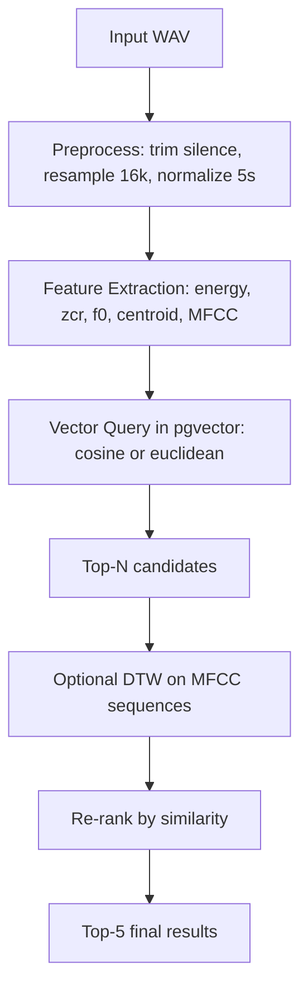

# Bao Cao He CSDL Luu Tru Va Tim Kiem Giong Noi Dan Ong

## 1) Du lieu am thanh
- Thu muc du lieu: ../male_dataset_500
- So luong file: 500 file WAV
- Chuan hoa do dai: 5 giay, tan so lay mau 16 kHz, kenh mono
- Dinh dang su dung: WAV

Ghi chu:
- He thong xu ly dau vao theo quy trinh preprocess de dua moi file ve cung do dai 5 giay.
- Buoc nay dam bao tinh dong nhat khi trich xuat dac trung va so khop.

## 2) Bo thuoc tinh nhan dien giong noi
He thong su dung bo dac trung 24 chieu:
- Nhom theo thoi gian:
  - Energy mean: muc nang luong trung binh cua tin hieu
  - ZCR mean: ty le cat diem zero, phan biet tinh chat huu thanh/vo thanh
- Nhom theo tan so:
  - Pitch mean (f0): do cao giong trung binh
  - Spectral centroid: trong tam pho
- Nhom MFCC:
  - 20 he so MFCC trung binh tren toan bo frame

Ly do lua chon:
- Energy, ZCR va spectral centroid phan anh dac trung timbre va cau truc pho co ban.
- Pitch mean giup phan biet xu huong cao do giong.
- MFCC la dac trung kinh dien cho bai toan giong noi do mo ta hinh dang pho gan voi nhan thuc am thanh.

Gia tri thong tin:
- Vector 24 chieu duoc luu vao CSDL vector de tim kiem nhanh bang cosine/euclidean.
- Ma tran MFCC theo frame duoc luu JSON de phuc vu DTW, giup xu ly sai khac toc do noi (co gian theo thoi gian).

## 3) CSDL luu tru va tim kiem
Cong nghe:
- PostgreSQL + pgvector
- SQLAlchemy ORM

Bang chinh:
- audio_metadata
  - id, file_name, duration, silence_ratio
  - energy_mean, zcr_mean, pitch_mean, spectral_centroid
  - feature_vector (Vector(24))
  - mfcc_matrix (JSON)

Ho tro tim kiem:
- Cosine distance tren feature_vector
- Euclidean (L2) distance tren feature_vector
- DTW re-ranking tren mfcc_matrix

## 4) He thong tim kiem 5 file giong nhat
Dau vao:
- 1 file am thanh moi (co the thuoc tap du lieu hoac chua xuat hien truoc do)

Dau ra:
- Top-5 file giong nhat
- Sap xep giam dan theo similarity (dong thoi hien distance de doi chieu)

### 4a) So do khoi va quy trinh

Quy trinh thuc hien:
1. Xu ly va trich xuat dac trung cho du lieu, sau do index vao CSDL.
2. Khi co query moi, trich xuat dac trung tuong tu.
3. Tim ung vien gan nhat bang vector search (cosine/euclidean).
4. Neu bat DTW: tinh DTW cho tap ung vien va xep hang lai.
5. Tra ve top-5.

### 4b) Ket qua trung gian
He thong co lenh trace de in ket qua trung gian:
- Thong tin query sau preprocess: silence_ratio, so mau, shape MFCCw
- Ket qua stage 1 (vector search)
- Ket qua stage 2 (DTW re-ranking)

Lenh:
- python search_engine.py trace --query <path_wav> --top-k 5 --dtw-candidate-pool 30

## 5) Demo va danh gia
Lenh demo:
1. Khoi dong CSDL:
   - docker compose up -d
2. Index du lieu:
   - python search_engine.py index --folder ../male_dataset_500
3. Tim kiem baseline:
   - python search_engine.py search --query ../male_dataset_500/male_voice_001.wav --metric cosine --top-k 5
   - python search_engine.py search --query ../male_dataset_500/male_voice_001.wav --metric euclidean --top-k 5
4. Tim kiem nang cao:
   - python search_engine.py search --query ../male_dataset_500/male_voice_001.wav --metric dtw --top-k 5 --dtw-candidate-pool 30
5. Hien ket qua trung gian:
   - python search_engine.py trace --query ../male_dataset_500/male_voice_001.wav --top-k 5 --dtw-candidate-pool 30

Danh gia dinh luong:
- python evaluate.py --dataset-folder ../male_dataset_500 --sample-size 100 --top-k 5 --dtw-candidate-pool 30
- Chi so bao cao:
  - Hit@1
  - Hit@5

Nhan xet ky thuat:
- Cosine/Euclidean: don gian, nhanh, dung ly thuyet truy van khong gian vector.
- DTW: tang do ben vung truoc sai khac toc do noi, thuong cho ket qua gan ngu nghia am thanh hon tren cap mau kho.

## 6) Giao dien co ban
He thong da co giao dien web don gian tai `audio_search/app.py`.

Chuc nang chinh:
- Index lai du lieu WAV vao CSDL.
- Upload file am thanh truy van.
- Chon metric `cosine`, `euclidean`, hoac `dtw`.
- Hien thi thong tin query, ung vien trung gian va top-5 ket qua cuoi cung.
- Phat audio truc tiep cho file truy van va cac file ket qua.

Lenh chay giao dien:
- uvicorn app:app --reload --app-dir audio_search

Mo tac nhanh:
1. Chay PostgreSQL + pgvector.
2. Mo giao dien web.
3. Index thu muc `../male_dataset_500`.
4. Tai len file am thanh moi va xem ket qua sap xep giam dan theo similarity.
